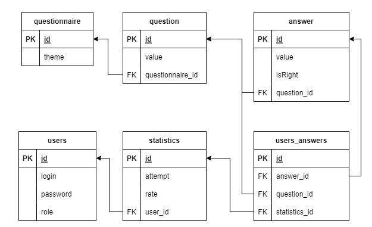
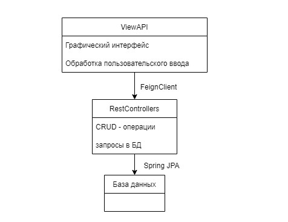

# Приложение "Тест-анкета"
Spring Boot/Web/Security/Mail + Bootstrap5(Thymeleaf)

DB: Spring JPA + H2 + Liquibase

entrypoint: localhost:8080

### ПЕРЕД ЗАПУСКОМ
в application.properties заполнить поля:

```
email = mail@gmail.com
password = pass
```
для доступа к smtp-серверу(иначе приложение не сможет отправлять сообщения на эл. почту).

(см. Аккаунт Google -> Безопасность -> Пароли приложений)

Администраторская учетка:
```
login: admin@app.com
password: admin
```

### О программе
Схема БД


Схема программы


Условно код разделен на 2 части: UI и Rest

package controllers отвечает за отображение UI и обработку пользовательского ввода

package api содержит RestController'ы, взаимодействующие с БД(CRUD-операции)

controllers и api общаются через FeignClient
